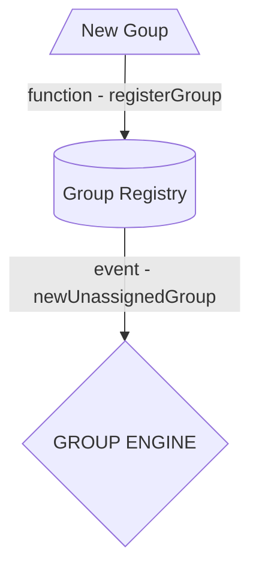
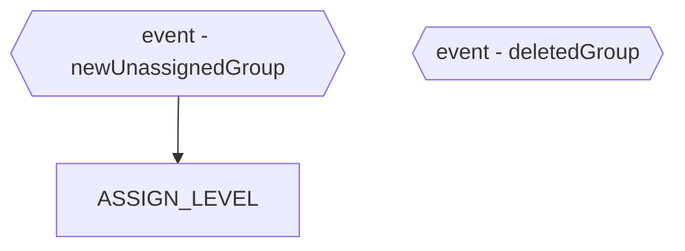

*(groupAssign cheatsheet for myself)*
## New Group Workflow

```mermaid
graph TD;
    NEW_GROUP[/New Goup\]-->|function - registerGroup|REGISTER_GROUP[(Group Registry)];
    REGISTER_GROUP-->|event - newUnassignedGroup|GROUP_ENGINE{GROUP ENGINE};
    GROUP_ENGINE
```

## Engine Workflow

```mermaid
graph TD;
    UNASSIGNED{{event - newUnassignedGroup}};
    DELETED{{event - deletedGroup}};
    UNASSIGNED-->ASSIGN_LEVEL
```